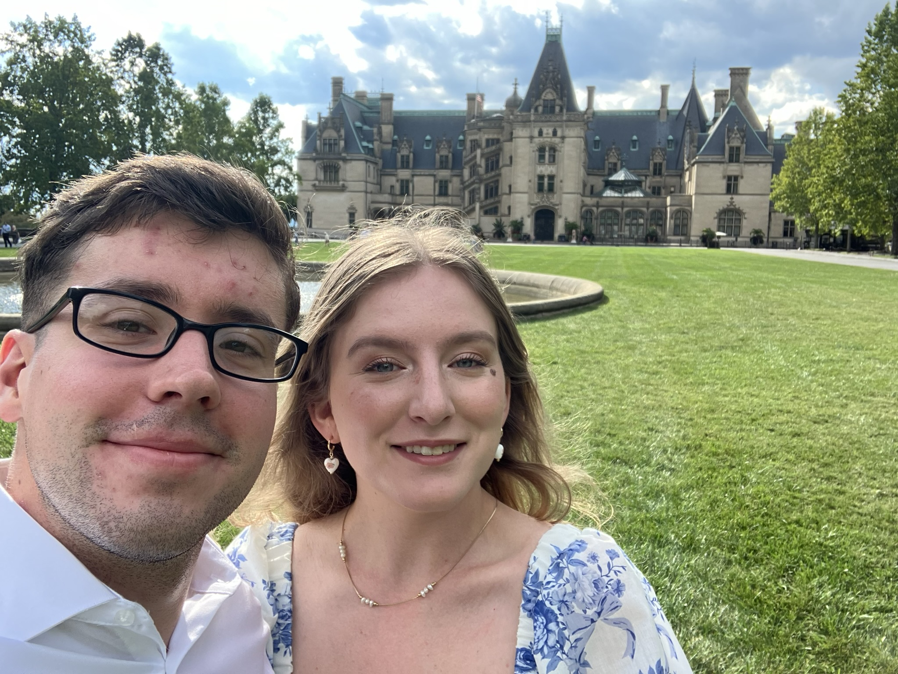
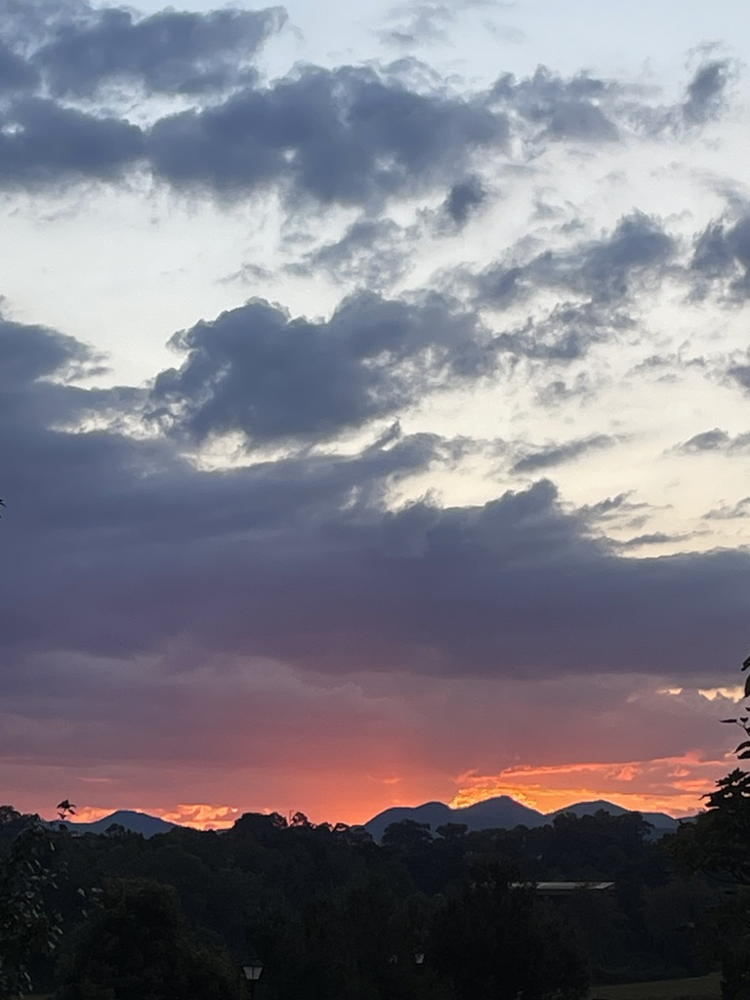

# Surprise Weekend Trip To Biltmore
## Grounds
At the main grounds of the mansion, we visited the stables, gardens, and front fountain lawn. We did not tour inside the house because we prefer to see the house decorated for Christmas. Focusing our attention on the rest of the property meant we could enjoy time outdoors while the flowers were still blooming without stressing about meeting time slots for reservations. 

The Stables at Biltmore used to house the horses and carriages for the estate, but have since been converted into shops and restaurants directly outside the mansion. 

### Places to visit in the stables
* The sweet shop
* The gift shop
* The book shop
* The welcome center
* The toy store

The only place we bought anything was the sweets shop, where we keep up our tradition of buying 2 dark chocolate truffles and 2 new flavored truffles to try. This time, we tried the limoncello truffles. 

There were so many gardens open to the public this season, as the blooming season ran later than expected. Before this, I had never gone to the gardens during blooming season, so it was a treat to see the fields of roses!

In order, we chose to visit:
1. Front lawn and fountain
2. The rose garden
3. The greenhouses

Our favrotie place to look at the property was from the front lawn because it was so special getting to see everyone's photo sessions. Some couples were taking wedding photos, Some families were getting ahead on Christmas cards, and one couple even brought their dogs in little dresses to pose at the mansion. Overall, it was such a sweet moment and I'm glad we got to see it all together!

For more information about Biltmore's Garden and greenhouse spaces, visit [this website!](https://www.biltmore.com/visit/biltmore-estate/gardens-grounds/)

## The Antler Hill Village 
After we took our pictures at the front of the house, we drove to Antler Hill Village, located at the farmgrounds on the property 5 miles from the main house. 

We ordered dinner at the bistro at the village, but did not want to overfill on large entrees, so we got to try the shareable options while watching village light up later into the afternoon. 

We ordered: 
* French onion soup
* Tomato basil biscque 
* A 3-Cheese charcuterie board

As we left, we watched the sun set on the mountains, and I remembered why we are always so drawn to Ashville. There's something so peaceful about watching the rolling hills explode into color, and just for a moment, the rest of the world stands still. This was the perfect end to a surprise trip, and I hope we get to go back soon! 

